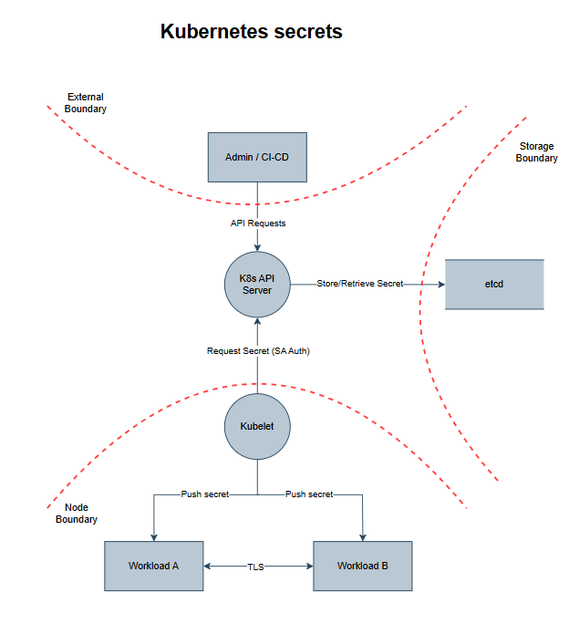
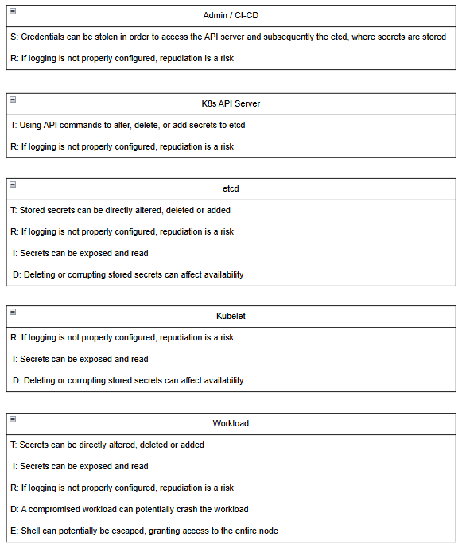
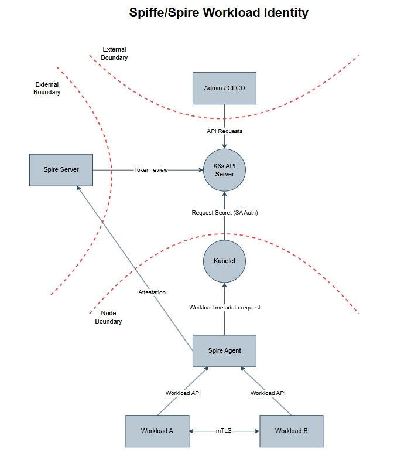
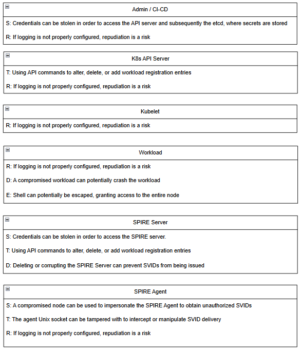

# Spire Deployment
This repository contains the necessary files to deploy a SPIFFE/SPIRE workload identity setup in a Kubernetes cluster.

The deployment creates a spire server, a spire agent, and two workloads inside a kubernetes cluster.
The spire agent will attest to the spire server (CA) and subsequently act on behalf of the spire server for workload attestation.
Finally, the workloads will attest and communicate with each other using their x.509 with SVIDs through mTLS.

## Installation
The full installation guide is in the PDF in this repo.

## Threat Models
The threat models are intended to show how the vulnerabilities change as you switch from using kubernetes secrets to workload identity via Spiffe, specifically from a workload perspective.
We use STRIDE and we create one threat model for each "scenario".

### Kubernetes Secrets

### SPIFFE/SPIRE Workload Identity

